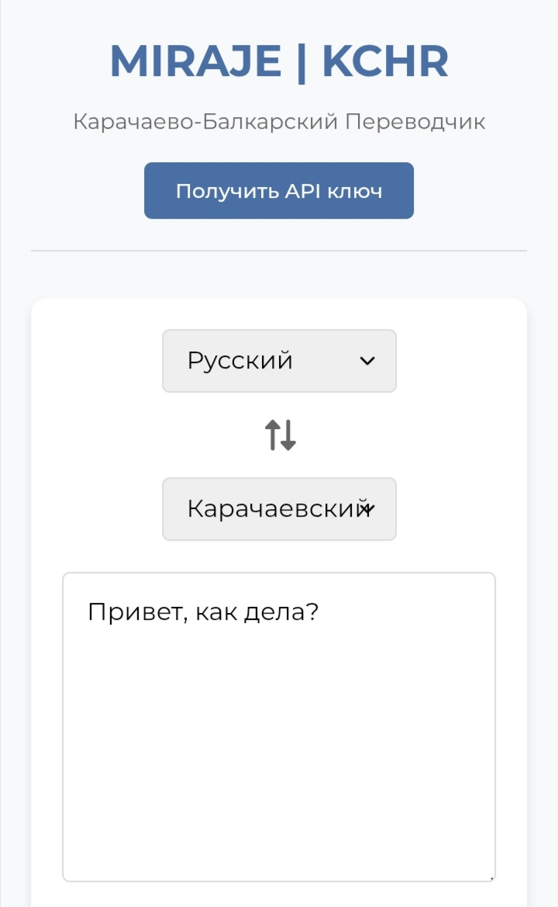

 MIRAJE | KCHR - Карачаево-Балкарский Переводчик

MIRAJE | KCHR - это открытый онлайн-переводчик между русским и карачаево-балкарским языками с поддержкой API.

 Особенности

- Двусторонний перевод (русский ↔ карачаево-балкарский)
- Поддержка больших текстов и отдельных слов
- Исправление опечаток и вариативное распознавание слов
- Контекстный перевод целых фраз
- Современный адаптивный интерфейс
- Простое REST API для интеграции
- Лёгкое расширение словарной базы

 Технологии

- Frontend: HTML5, CSS3, JavaScript (ES6+)
- Backend: Node.js, Express
- Алгоритмы: Расстояние Левенштейна для исправления опечаток
- Хранение данных: Текстовый файл (words.txt)

 Установка и запуск

1. Клонируйте репозиторий:
bash
git clone https://github.com/ftoop17/miraje-kchr-translator.git
cd miraje-kchr-translator

2. Установите зависимости для сервера:
bash
cd server
npm install

3. Запустите сервер:
bash
npm start

4. Откройте `public/index.html` в браузере

 Структура файлов

miraje-kchr-translator/
├── public/             Фронтенд
│   ├── index.html      Главная страница
│   ├── style.css       Стили
│   ├── app.js          Клиентский скрипт
│   └── words.txt       База слов и фраз
├── server/             Бэкенд
│   ├── server.js       Сервер и API
│   ├── database.js     Работа с данными
│   └── package.json    Зависимости Node.js
└── README.md           Документация

 Использование API

Отправляйте POST-запросы на `/api/translate`:

json
{
  "sourceLang": "ru",
  "targetLang": "kchr",
  "text": "Текст для перевода",
  "apiKey": "ваш_api_ключ"
}

Пример ответа:
json
{
  "success": true,
  "translatedText": "Переведённый текст",
  "sourceText": "Исходный текст"
}

 Добавление новых слов

Редактируйте файл `public/words.txt` в формате:

русское_слово = карачаевское_слово
фраза на русском = перевод на карачаевском

 Контакты

- Автор: [thetemirbolatov](https://github.com/ftoop17)
- ВКонтакте: [thetemirbolatov](https://vk.com/thetemirbolatov)
- По вопросам сотрудничества: mirajestory@gmail.com